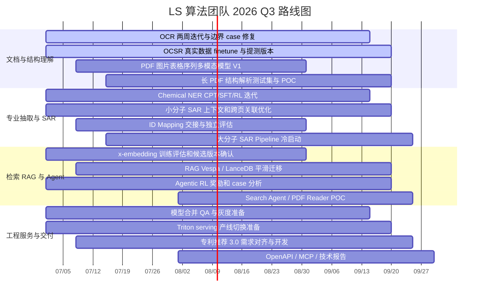
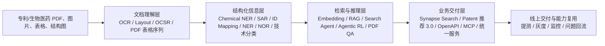

# OpenViking 检索结果包

- 生成时间：2026-07-09 15:47:44
- 用户问题：算法团队_2026Q3规划 算法团队 2026Q3规划 2026Q3 规划 LS 算法团队的相关资料 算法团队的 算法团队的相关 LS_算法团队的相关资料
- 召回关键词：算法团队_2026Q3规划、算法团队、2026Q3规划、2026Q3、规划、LS、算法团队的相关资料、算法团队的、算法团队的相关、LS_算法团队的相关资料
- 检索范围：`viking://resources/informationhouse/`
- 候选资源数：6
- 是否包含全文：是

## 可直接输入后续 skill / LLM 的检索摘要

我已按“关键词提取 + 全库语义检索 + 正则精确检索 + 关键词重排”召回相关内容。

召回关键词：算法团队_2026Q3规划、算法团队、2026Q3规划、2026Q3、规划、LS、算法团队的相关资料、算法团队的、算法团队的相关、LS_算法团队的相关资料

可用于后续 skill/LLM 的依据：
1. `viking://resources/informationhouse/02_project_materials/LS算法团队_2026Q3规划/LS_算法团队_2026_Q3_工作规划/7._主线四工程服务与交付_6more_2d5b89e6.md`
   摘要：viking://resources/informationhouse/02_project_materials/LS算法团队_2026Q3规划/LS_算法团队_2026_Q3_工作规划/7._主线四工程服务与交付_6more_2d5b89e6.md --- ## 7. 主线四：工程服务与交付 ### 7.1 Triton serving 产线切换 目标是用标准化 Triton serving 替换老旧 model-serving 框架，支持 mmBERT、Qwen3-Embedding 等新模型部署。 | 模块 | Q3 要求 | | --- | --- | | 权重管理 | 启动时扫描 model_hub.conf，从 modelhub 拉取指定版本权重。 | | 服务发布 | 支持 CICD 发布服务。 | | 推理逻辑 | 支持 Triton Python Backend。 | | readiness | 支持 redi...
   关键词匹配分：43
2. `viking://resources/informationhouse/02_project_materials/LS算法团队_2026Q3规划/LS_算法团队_2026_Q3_工作规划/4._主线一文档与结构理解基座.md`
   摘要：viking://resources/informationhouse/02_project_materials/LS算法团队_2026Q3规划/LS_算法团队_2026_Q3_工作规划/4._主线一文档与结构理解基座.md --- ## 3. Q3 路线图 说明：以下日期是团队规划整合后的建议排期，用于项目管理，不是成员源文档中的原始日期指标。 ```mermaid gantt title LS 算法团队 2026 Q3 路线图 dateFormat YYYY-MM-DD axisFormat %m/%d section 文档与结构理解 OCR 两周迭代与边界 case 修复 :active, 2026-07-01, 2026-09-15 OCSR 真实数据 finetune 与提测版本 :active, 2026-07-01, 2026-09-20 PDF 图片表格序列多模态模型 V1 :2026-07-08, 2026-0...
   关键词匹配分：40
3. `viking://resources/informationhouse/02_project_materials/LS算法团队_2026Q3规划/LS_算法团队_2026_Q3_工作规划/5._主线二专业抽取与_SAR.md`
   摘要：viking://resources/informationhouse/02_project_materials/LS算法团队_2026Q3规划/LS_算法团队_2026_Q3_工作规划/5._主线二专业抽取与_SAR.md --- ## 5. 主线二：专业抽取与 SAR ### 5.1 Chemical NER 目标是提升小分子识别和名称到结构转化能力，减少对传统工具的依赖，提高化合物与结构关联覆盖。 | 阶段 | 内容 | | --- | --- | | H1 现状 | jechem 方案准确率约 54%；30B 模型效果优于线上但推理成本高；蒸馏到 0.6B 后效果明显下降；Qwen8B 微调 + RL 后 acc 相比线上提升 10%，约 64%。 | | Q3 路线 | CPT + SFT + RL。继续训练 CPT 模型，补齐专业领域数据。 | | 数据难点 | iupac->smiles、smiles->iupac...
   关键词匹配分：40
4. `viking://resources/informationhouse/02_project_materials/LS算法团队_2026Q3规划/LS_算法团队_2026_Q3_工作规划/6._主线三检索RAG_与_Agent.md`
   摘要：viking://resources/informationhouse/02_project_materials/LS算法团队_2026Q3规划/LS_算法团队_2026_Q3_工作规划/6._主线三检索RAG_与_Agent.md --- ## 6. 主线三：检索、RAG 与 Agent ### 6.1 Embedding 与 RAG | 工作 | Q3 目标 | 技术细节与指标 | | --- | --- | --- | | x-embedding | 完成训练与评估，整体指标平均提升 5%。 | 吴文涛 H1 在 500w top100 检索测试中发现 description 中文 66.19、英文 64.18 已显著超过线上 61.74/56.42；abstract、claim、patent_id 仍需补齐，尤其 patent_id 英文线上 69.19，当前 v1.9 为 61.86。 | | LS embedding...
   关键词匹配分：40
5. `viking://resources/informationhouse/02_project_materials/LS算法团队_2026Q3规划/LS_算法团队_2026_Q3_工作规划/LS_算法团队_2026_Q3_工_2more_4208e84b.md`
   摘要：viking://resources/informationhouse/02_project_materials/LS算法团队_2026Q3规划/LS_算法团队_2026_Q3_工作规划/LS_算法团队_2026_Q3_工_2more_4208e84b.md --- # LS 算法团队 2026 Q3 工作规划 版本：2026-07-02 ## 1. 团队 Q3 总目标 Q3 团队目标是把 H1 已经形成的文档理解、检索增强、模型合并和领域抽取能力，推进到面向业务交付的可提测、可灰度、可复用工程闭环。整体规划分为四条主线： 1. 文档与结构理解基座：提升 OCR、Layout、OCSR、长 PDF 结构解析、PDF 图片表格序列抽取能力，支撑专利和生物医药长文档理解。 2. 专业信息抽取与 SAR：提升 Chemical NER、小分子 SAR、ID Mapping、大分子 SAR、NER/NOR/专利技术分类等领域模型能力。...
   关键词匹配分：40
6. `viking://resources/informationhouse/02_project_materials/LS算法团队_2026Q3规划/LS_算法团队_2026_Q3_工作规划/2._Q3_团队_OKR.md`
   摘要：viking://resources/informationhouse/02_project_materials/LS算法团队_2026Q3规划/LS_算法团队_2026_Q3_工作规划/2._Q3_团队_OKR.md --- ## 2. Q3 团队 OKR ### O1. 建成专利/生物医药文档理解基础能力 | KR | 负责人 | 验收指标 | Q3 产出 | | --- | --- | --- | --- | | OCR 任务训练收尾并完成自测验证 | 皇甫圆翔 | 专利/生物医药垂域自测集效果超过 MinerU 2.5 Pro；公开测试集超过 MOSS 和 MinerU 2.5。当前公开集 RL 版本 Text Edit Distance=0.033，Table TEDS=90.75；MOSS-OCR 为 0.049/90.31，MinerU2.5-1.2B 为 0.047/88.46。 | 每两周迭代一次；完成边界 c...
   关键词匹配分：40

后续对接 skill 时优先传这些 URI 和摘要；如果需要更高准确度，可以再用 `openviking_multi_read` 按 URI 读取全文。

## 命中资源明细

### 1. viking://resources/informationhouse/02_project_materials/LS算法团队_2026Q3规划/LS_算法团队_2026_Q3_工作规划/7._主线四工程服务与交付_6more_2d5b89e6.md

- 关键词匹配分：43
- URI：`viking://resources/informationhouse/02_project_materials/LS算法团队_2026Q3规划/LS_算法团队_2026_Q3_工作规划/7._主线四工程服务与交付_6more_2d5b89e6.md`

摘要/片段：

viking://resources/informationhouse/02_project_materials/LS算法团队_2026Q3规划/LS_算法团队_2026_Q3_工作规划/7._主线四工程服务与交付_6more_2d5b89e6.md --- ## 7. 主线四：工程服务与交付 ### 7.1 Triton serving 产线切换 目标是用标准化 Triton serving 替换老旧 model-serving 框架，支持 mmBERT、Qwen3-Embedding 等新模型部署。 | 模块 | Q3 要求 | | --- | --- | | 权重管理 | 启动时扫描 model_hub.conf，从 modelhub 拉取指定版本权重。 | | 服务发布 | 支持 CICD 发布服务。 | | 推理逻辑 | 支持 Triton Python Backend。 | | readiness | 支持 redi...

全文内容：

## 7. 主线四：工程服务与交付

### 7.1 Triton serving 产线切换

目标是用标准化 Triton serving 替换老旧 model-serving 框架，支持 mmBERT、Qwen3-Embedding 等新模型部署。

| 模块 | Q3 要求 |
| --- | --- |
| 权重管理 | 启动时扫描 model_hub.conf，从 modelhub 拉取指定版本权重。 |
| 服务发布 | 支持 CICD 发布服务。 |
| 推理逻辑 | 支持 Triton Python Backend。 |
| readiness | 支持 redis API 验证模型加载状态。 |
| 切换策略 | 优先新机器部署新模型，流量切换完成后下线旧模型并缩减资源。 |
| 风险 | eureka rag 等调用方仍有旧服务依赖，切换前需要确认调用方式或完成适配。 |

### 7.2 OpenAPI / MCP / 专利推荐 3.0

| 方向 | 负责人 | Q3 产出 |
| --- | --- | --- |
| OCSR OpenAPI / MCP Skill | 张冬 | 完成 ocsr-wrapper 服务开发、自测、部署；与开放平台沟通推进 OpenAPI 上线；完成 MCP Skill 部署与维护。 |
| 技术报告与学术沉淀 | 张冬、皇甫圆翔、仲汉勐 | OCSR 多路自回归/VLLM 技术报告；PDF RAG 上下文系统若验证有效，整理方法设计、实验结果、消融分析并推进投稿；OCR judge/reward model 相关研究继续验证。 |
| 专利推荐 3.0 | 吕子楠 | 重新对齐需求、指标口径、评估集、验收标准、关键场景；完成召回、排序、技术主题分类、结果解释和问题回流机制的核心链路。 |

## 8. 交付保障

本节只定义团队交付底线，不作为 Q3 的独立重点投入。各方向仍以能力建设和业务落地为主，指标只用于判断是否能进入提测、灰度或上线。

| 保障项 | 要求 | 适用范围 |
| --- | --- | --- |
| 基线对齐 | 所有进入提测的模型需说明相对线上版本或候选竞品的变化，避免只看单点实验结果。 | OCR、OCSR、Chemical NER、SAR、Embedding、模型合并 |
| 灰度与回滚 | 涉及线上替换、服务收敛或框架切换时，必须有灰度范围、回滚路径和调用方适配清单。 | Triton serving、RAG 迁移、NER/NOR 合并、专利推荐 3.0 |
| Case 回流 | 失败 case 按数据、模型、后处理、上下文、工具调用、服务依赖归因，进入下一轮迭代。 | 全方向 |
| 文档沉淀 | 关键项目保留数据路径、训练任务号、核心配置、上线状态和遗留风险。 | 全方向 |

## 9. 人员分工总表

| 成员 | Q3 主责 | 关键交付 | 关键指标 |
| --- | --- | --- | --- |
| 张冬 | OCSR 带坐标模型、OpenAPI/MCP、技术报告 | 2+ 个 OCSR 提测版本；ocrs-wrapper；OpenAPI/MCP；技术报告 | SMILES 0.75-0.80；coordinates ±1 bin full match 70%+，atom level 90%+；真实数据 500K-5M |
| 吕子楠 | 模型合并 QA、专利推荐 3.0、Triton serving | NER/专利技术分类/NOR rerank QA 与灰度；专利推荐 3.0 核心链路；Triton 产线准备 | 核心场景不低于线上基线；7->1、6->1 服务收敛稳定；支持 modelhub/CICD/Python Backend/redis 验证 |
| 皇甫圆翔 | OCR、长 PDF、Layout、Agentic PDF QA、学术研究 | OCR 边界 case 迭代；长 PDF 结构解析 POC；layout 调研；Agentic PDF Reader baseline | 垂域自测集超过 MinerU 2.5 Pro；公开集超过 MOSS/MinerU2.5；page/block recall@k、树编辑距离、图文引用 F1 |
| 王煦 | x-embedding、RAG 迁移、LS embedding、Search Agent | x-embedding 训练评估；Vespa/LanceDB 迁移；Search Agent POC | embedding 指标平均提升 5%；RAG 召回提升 5%；NDCG/MRR 持续对比 |
| 徐永斌 | Chemical NER、PDF 图片表格序列抽取 | Chemical NER CPT/SFT/RL；PDF 表格序列多模态模型 V1 | Chemical NER P/R 90%/90%，保守 80%/80%；PDF 图片表格序列召回率提升 |
| 吴文涛 | Agentic RL、x-embedding 实验与评测 | RL 奖励优化、case 分析、模型差距闭环；x-embedding 候选版本 | 缩小 H1 差距：key_facts_recall 当前 0.409、trajectory_step_coverage 当前 0.371、duplicate_rate 当前 0.09-0.22 |
| 仲汉勐 | 小分子 SAR、PDF RAG 上下文、ID Mapping、大分子 SAR | 小分子 SAR 优化；ID Mapping 交接；大分子 SAR Pipeline；PDF RAG 上下文 POC | 小分子 SAR P/R 95%/70%；ID Mapping 85%/70%；大分子 SAR 50%/50% |

## 10. 建议里程碑与决策点

说明：本节为团队整合排期，不来自成员文档的原始日期。

| 时间 | 里程碑 | 决策点 |
| --- | --- | --- |
| 2026-07 中旬 | 完成各方向 Q3 交付范围、核心指标和协作依赖确认。 | 是否需要新增标注、QA、工程或产品资源。 |
| 2026-07 末 | OCR/OCSR/Chemical NER/SAR/Embedding/RAG 完成第一轮 baseline 或候选版本评估。 | 对未达标方向判断是补数据、改模型还是调后处理。 |
| 2026-08 中旬 | OCSR、Chemical NER、x-embedding、模型合并、Triton 完成中期版本验证。 | 是否进入提测/灰度准备；是否保留旧服务。 |
| 2026-08 末 | RAG 迁移、PDF 表格序列模型、长 PDF 结构解析、Search Agent POC 完成可用性评估。 | 是否进入业务联调；是否扩大数据集或转入后续迭代。 |
| 2026-09 中旬 | 通过 QA 的模型和服务进入灰度/上线准备。 | 灰度范围、回滚策略、监控阈值和下线旧服务计划。 |
| 2026-09 末 | 完成 Q3 总结、技术报告、论文/开源候选判断、Q4 backlog。 | 哪些方向转正式产品能力，哪些方向继续研究。 |

## 11. 风险与依赖

| 风险/依赖 | 影响方向 | 应对方式 |
| --- | --- | --- |
| 高质量标注不足 | OCSR、Chemical NER、SAR、长 PDF、Agentic PDF QA | 提前锁定 Content/QA 支持；OCSR 特殊结构每类至少 10 篇专利；优先维护 OCSR_Review 和 SAR case benchmark。 |
| 合成数据与真实数据 domain gap | OCSR、OCR、Chemical NER | 真实数据 finetune、规则粗筛、人工补标、case 归因，避免只看合成集指标。 |
| 复杂 PDF 跨页与图表关系难 | OCR/Layout、SAR、PDF QA | 引入文档树、块级关系图、混合粒度索引和证据 recall 指标。 |
| 多任务模型 macro 指标掩盖单场景退化 | NER、专利技术分类、NOR rerank | QA 按 data_source、实体类型、技术主题、NOR 类型拆分指标。 |
| 新旧服务依赖复杂 | Triton、RAG 迁移、模型合并 | 新机器部署、灰度切流、Apollo 配置治理、回滚路径和调用方适配清单。 |
| 推理成本与速度 | OCR、Chemical NER、Agent/RAG | 蒸馏/低维压缩/MRL、投机采样、输出格式优化、工具调用停止条件。 |
| 交付口径不统一 | 全方向 | 每个方向明确进入提测、灰度或上线的最低条件，避免季度末才重新定义成功标准。 |

## 12. Q3 管理机制

1. 例行同步：OCR、OCSR、Chemical NER、SAR、Embedding/RAG、Agentic RL 定期同步业务进展、关键指标、失败 case 和下轮动作。
2. 提测门槛：必须具备核心指标对比、case 归因、灰度/回滚方案；没有回滚路径的模型不进入生产切换。
3. 数据闭环：所有失败 case 按数据问题、模型能力、后处理、工具调用、上下文缺失、服务依赖六类归因，并进入下一轮训练或规则修正。
4. 交付沉淀：关键方向形成可复用文档，包括数据路径、训练任务号、评估脚本、指标结果、问题清单和下一步计划。
5. 资源优先级：优先保障可进入业务提测或明显补齐核心短板的方向，包括 OCR/OCSR、Chemical NER、小分子 SAR、x-embedding/RAG、模型合并和 Triton 切换。

### 2. viking://resources/informationhouse/02_project_materials/LS算法团队_2026Q3规划/LS_算法团队_2026_Q3_工作规划/4._主线一文档与结构理解基座.md

- 关键词匹配分：40
- URI：`viking://resources/informationhouse/02_project_materials/LS算法团队_2026Q3规划/LS_算法团队_2026_Q3_工作规划/4._主线一文档与结构理解基座.md`

摘要/片段：

viking://resources/informationhouse/02_project_materials/LS算法团队_2026Q3规划/LS_算法团队_2026_Q3_工作规划/4._主线一文档与结构理解基座.md --- ## 3. Q3 路线图 说明：以下日期是团队规划整合后的建议排期，用于项目管理，不是成员源文档中的原始日期指标。 ```mermaid gantt title LS 算法团队 2026 Q3 路线图 dateFormat YYYY-MM-DD axisFormat %m/%d section 文档与结构理解 OCR 两周迭代与边界 case 修复 :active, 2026-07-01, 2026-09-15 OCSR 真实数据 finetune 与提测版本 :active, 2026-07-01, 2026-09-20 PDF 图片表格序列多模态模型 V1 :2026-07-08, 2026-0...

全文内容：

## 3. Q3 路线图

说明：以下日期是团队规划整合后的建议排期，用于项目管理，不是成员源文档中的原始日期指标。



## 4. 主线一：文档与结构理解基座

### 4.1 OCR 与 Layout

技术路线：

- 基座模型：Qwen3.5-0.8B，当前已完成 SFT 与 RL dapo 13k step 实验。
- 训练数据：7000 篇专利、4000 篇补充专利、pubtables-v2、pubtabnet、blur 重复型数据、垂域合成数据。
- 指标：文本使用归一化编辑距离，越低越好；表格使用 TEDS，越高越好。
- 迭代节奏：两周一次，以极少数边界情况、公式识别、序列格式定义、推理速度为主要增量。

当前关键数据：

| 测试集 | 模型 | Text Edit Distance | Table TEDS | 判断 |
| --- | --- | ---: | ---: | --- |
| OmniDocBench v1.5 | Qwen3.5-0.8B SFT | 0.038 | 91.08 | 已优于 MOSS/MinerU2.5 文本和 MinerU2.5 表格，但低于 GLM-OCR 表格。 |
| OmniDocBench v1.5 | Qwen3.5-0.8B RL dapo | 0.033 | 90.75 | 文本进一步提升，表格略降，需要做多目标平衡。 |
| OmniDocBench v1.5 | MOSS-OCR | 0.049 | 90.31 | Qwen RL 文本误差少 0.016，表格领先 0.44。 |
| OmniDocBench v1.5 | GLM-OCR | 0.040 | 93.96 | Qwen RL 文本更优，表格仍落后 3.21。 |
| OmniDocBench v1.5 | MinerU2.5-1.2B | 0.047 | 88.46 | Qwen RL 文本误差少 0.014，表格领先 2.29。 |

Q3 重点：

- 垂域自测集上补齐与 MinerU-1.2B-pro 的差距：当前 Text Edit Distance 多 0.016，Table TEDS 还差 0.50。
- 配合完成 GLM-OCR 替换验证，包括接口适配、效果对比、速度对比，并联合优化 SAR 下游效果。
- 速度优化方向包括投机采样和输出数据格式优化。
- Layout 调研需要覆盖版面检测、阅读顺序恢复、表格/图片/公式/标题识别、跨页元素关联、数据集授权与内部评测方法。

### 4.2 OCSR 带坐标预测

技术路线：

- 数据闭环：数据预标 -> 模型训练和预测 -> 数据修正 -> 再训练。
- 真实数据基本盘：通过规则粗筛 USPTO、供应商数据形成 finetune 数据，规模 500K-5M。
- 训练迁移顺序：普通完整分子 -> 复杂多环大分子 -> 简单 Markush -> 特殊结构类型。
- 训练与模型代码：`synthesis_no_trainer_v2.py`、`mol_vision_encoder_decoder.py`、`modeling_molbart.py`、`configuration_molbart.py`、`smiles_utils.py`、`augmentations_utils.py`、`inference.py`。

Q3 验收：

| 模块 | 指标或产出 |
| --- | --- |
| 提测版本 | 2+ 个带坐标预测能力的 OCSR 模型版本。 |
| SMILES | QA 准确率 0.75-0.80。 |
| 坐标 | coordinates ±1 bin full match 70%+，atom level 90%+。 |
| 数据集 | 稳定合成数据、真实 finetune 数据、评测数据集，重点补坐标标注和 schema 兼容。 |
| Benchmark | 完善 OCSR_Review benchmark，使用 bin_count_same、bin_F1@1、bin_FM@1、MAE/RMSE 等指标。 |

需要支持的结构类型：

- 常规单组分小分子结构。
- 常规 RGroup、attachment、缩写基团。
- 多组件结构。
- SRU / 大括号结构。
- LINKNODE。
- DASH BOND / 特殊楔形键表达。
- 同位素、特殊电荷标记。
- 大分子、大图小结构、小图大结构。
- 缩写词 label 收集、局部结构映射、长尾结构简式 -> SMARTS 解析。

### 4.3 长 PDF 与图片表格序列

长 PDF 方向重点不再是单页 OCR，而是文档级结构重建和跨页证据组织：

| 模块 | 技术重点 | 评测指标 |
| --- | --- | --- |
| 文档树重建 | 章节层级、段落归属、标题正文绑定、目录正文对齐、页眉页脚过滤。 | 树编辑距离。 |
| 跨页语义连续性 | 定义、公式、表格、结论跨页归并。 | 证据页 recall@k、证据块 recall@k。 |
| 图表正文关联 | 图题、正文解释、图注、脚注、跨页大表表头合并。 | 图文引用 F1。 |
| 混合粒度索引 | 页、块、章节、表格、图片混合索引，避免固定 token 切分损失版面关系。 | 下游 QA/SAR 抽取效果。 |

PDF 图片表格序列方向：

- 数据覆盖 CN、EP、US、CA、WO 国家 PDF。
- 预处理产物包括表格 bbox、序列、序列 ID、类型、修饰序列上下文。
- 技术方案结合多模态模型、OCR 模型和 embedding 模型，参考 llm2clip 做文本与图片表格上下文关联。
- Q3 完成第一版多模态模型训练，目标是在图片表格序列端到端召回率上取得提升。

### 3. viking://resources/informationhouse/02_project_materials/LS算法团队_2026Q3规划/LS_算法团队_2026_Q3_工作规划/5._主线二专业抽取与_SAR.md

- 关键词匹配分：40
- URI：`viking://resources/informationhouse/02_project_materials/LS算法团队_2026Q3规划/LS_算法团队_2026_Q3_工作规划/5._主线二专业抽取与_SAR.md`

摘要/片段：

viking://resources/informationhouse/02_project_materials/LS算法团队_2026Q3规划/LS_算法团队_2026_Q3_工作规划/5._主线二专业抽取与_SAR.md --- ## 5. 主线二：专业抽取与 SAR ### 5.1 Chemical NER 目标是提升小分子识别和名称到结构转化能力，减少对传统工具的依赖，提高化合物与结构关联覆盖。 | 阶段 | 内容 | | --- | --- | | H1 现状 | jechem 方案准确率约 54%；30B 模型效果优于线上但推理成本高；蒸馏到 0.6B 后效果明显下降；Qwen8B 微调 + RL 后 acc 相比线上提升 10%，约 64%。 | | Q3 路线 | CPT + SFT + RL。继续训练 CPT 模型，补齐专业领域数据。 | | 数据难点 | iupac->smiles、smiles->iupac...

全文内容：

## 5. 主线二：专业抽取与 SAR

### 5.1 Chemical NER

目标是提升小分子识别和名称到结构转化能力，减少对传统工具的依赖，提高化合物与结构关联覆盖。

| 阶段 | 内容 |
| --- | --- |
| H1 现状 | jechem 方案准确率约 54%；30B 模型效果优于线上但推理成本高；蒸馏到 0.6B 后效果明显下降；Qwen8B 微调 + RL 后 acc 相比线上提升 10%，约 64%。 |
| Q3 路线 | CPT + SFT + RL。继续训练 CPT 模型，补齐专业领域数据。 |
| 数据难点 | iupac->smiles、smiles->iupac、chemical ner->iupac、smiles->canonical smiles、iupac zh->iupac en 数据较难获取。 |
| Q3 指标 | 预期 precision 90%、recall 90%；保守 precision 80%、recall 80%。 |

### 5.2 小分子 SAR

Q3 重点提升专利 SAR 端到端关键字段提取能力，覆盖结构、活性、靶点、化合物名称等关键字段。

| 优化方向 | 说明 |
| --- | --- |
| 上下文切分 | 缓解当前规则切分在页码跨度大、表格跨页、活性数据分散描述场景下的局限。 |
| 跨页信息关联 | 处理正文、表格、图注、脚注、续表之间的跨页依赖。 |
| 活性表格与正文关联 | 把活性数值、化合物、靶点和上下文描述绑定。 |
| 后处理一致性校验 | 对字段格式、化合物 ID、活性单位、靶点关系做一致性约束。 |
| PDF RAG 上下文系统 | 自动识别、检索并重构任务相关上下文，作为下游抽取模型输入。 |

验收指标：预期 precision 95%、recall 70%；保守 precision 80%、recall 70%。

### 5.3 ID Mapping 与大分子 SAR

| 方向 | Q3 目标 | 指标 |
| --- | --- | --- |
| ID Mapping | 完成任务背景、业务目标、数据格式、训练流程、评估标准、常见问题处理流程沉淀，支持独立训练和实验复现。 | 预期 precision 85%、recall 70%；保守 precision 75%、recall 70%。 |
| 大分子 SAR | 梳理大分子与小分子 SAR 的差异，复用活性提取、上下文构建、结果校验模块，围绕抗体 ID Mapping、序列与靶点关系识别做差异化 POC。 | 端到端关键字段 precision 50%、recall 50%；保守完成核心模块 POC 与初版 Pipeline。 |

### 5.4 模型合并与统一服务

H1 已形成模型合并基础：

| 方向 | H1 结果 | Q3 动作 |
| --- | --- | --- |
| Synapse NER | 7 个专项 NER 接口/模型入口 -> 1 个统一 ner_ls 服务；合并模型 macro F1 86.80，线上基线 87.13；合并模型 macro recall 88.16，高于线上 87.48。 | 完成 QA 验证，重点检查不同 data_source 的兼容性和稳定性；不达标场景做数据清洗、后处理或定向样本补充。 |
| 专利技术分类 | 蛋白质药物、寡核苷酸、基因疗法、载体拓展、细胞疗法、小分子化药 6 个主题模型 -> 1 套多任务模型；macro F1 82.58，线上基线 82.89。 | 验证 6 个主题在统一模型下的稳定性，避免单主题指标被 macro 指标稀释。 |
| Synapse NOR rerank | 4 个 rerank 子模型 -> 统一 rerank 模型；临床终点指标 F1 96.83 -> 96.99；patent_cn F1 80.35 -> 80.38。 | patent_en、ct_en 仍需定位 gap；完成 el_ls_qa、snp_el_ddt_en_v2、el_ddt_cn、el-org-ls-en、ct-outcome-linking 等 QA 回归。 |

### 4. viking://resources/informationhouse/02_project_materials/LS算法团队_2026Q3规划/LS_算法团队_2026_Q3_工作规划/6._主线三检索RAG_与_Agent.md

- 关键词匹配分：40
- URI：`viking://resources/informationhouse/02_project_materials/LS算法团队_2026Q3规划/LS_算法团队_2026_Q3_工作规划/6._主线三检索RAG_与_Agent.md`

摘要/片段：

viking://resources/informationhouse/02_project_materials/LS算法团队_2026Q3规划/LS_算法团队_2026_Q3_工作规划/6._主线三检索RAG_与_Agent.md --- ## 6. 主线三：检索、RAG 与 Agent ### 6.1 Embedding 与 RAG | 工作 | Q3 目标 | 技术细节与指标 | | --- | --- | --- | | x-embedding | 完成训练与评估，整体指标平均提升 5%。 | 吴文涛 H1 在 500w top100 检索测试中发现 description 中文 66.19、英文 64.18 已显著超过线上 61.74/56.42；abstract、claim、patent_id 仍需补齐，尤其 patent_id 英文线上 69.19，当前 v1.9 为 61.86。 | | LS embedding...

全文内容：

## 6. 主线三：检索、RAG 与 Agent

### 6.1 Embedding 与 RAG

| 工作 | Q3 目标 | 技术细节与指标 |
| --- | --- | --- |
| x-embedding | 完成训练与评估，整体指标平均提升 5%。 | 吴文涛 H1 在 500w top100 检索测试中发现 description 中文 66.19、英文 64.18 已显著超过线上 61.74/56.42；abstract、claim、patent_id 仍需补齐，尤其 patent_id 英文线上 69.19，当前 v1.9 为 61.86。 |
| LS embedding | 持续优化模型、数据集和评估集，沉淀训练评估流程。 | H1 构建 20W+ 医药专利训练数据和 1.1W 测试集；qwen3_0.6B 微调后 NDCG@10/MRR@10 达 0.838/0.816，较 bge-m3 的 0.71/0.69 提升约 12%；MRL 1024 维降到 128 维后准确率仅下降约 4%。 |
| RAG 迁移 | 完成 RAG 系统向 Vespa / LanceDB 全面平滑迁移。 | 目标召回提升 5%；必须具备索引验证、链路回滚、线上稳定性验证和配置治理。 |

### 6.2 Agentic RL 与 Search Agent

H1 Agentic RL 已建立真实 query 测试集和三层指标体系，源文档只给出当前差距和 Q3 优化方向，未给出新的 Q3 数值验收线：

| 层级 | 指标 | Q3 优化重点 |
| --- | --- | --- |
| Layer 1 回答质量 | accuracy、coverage、citation、structure、depth、average | Qwen 当前 average 约 3.84-3.86，GPT-5.5 为 4.31；重点提升 accuracy 和 citation。 |
| Layer 2 工具使用能力 | tool_selection_f1、tool_call_count、tool_diversity、empty_result_rate、duplicate_rate、parallel_call_rate | 当前 Qwen duplicate_rate 0.09-0.22，高于 GPT-5.5 的 0.03；tool_call_count 12.45-19.71，高于 GPT-5.5 的 10.73，需减少重复检索和无效调用。 |
| Layer 3 精标子集 | key_facts_recall、trajectory_step_coverage、trajectory_tool_sequence_f1 | 当前 Qwen key_facts_recall 0.409，GPT-5.5 为 0.662；trajectory_step_coverage 0.371，GPT-5.5 为 0.628，是 Q3 重点。 |

Q3 动作不新增源文档外硬指标，围绕关键事实召回、轨迹覆盖、重复检索和停止条件做奖励设计与 case 分析。

Search Agent 研究方向：

- 查询理解：query rewrite、intent detection、question split、text2intent。
- 工具调用：多路召回、工具选择、停止条件、重复检索抑制。
- 结果融合：RRF、rerank、citation、key facts recall。
- 可解释回答：结构化输出、证据引用、不可回答判断。
- POC 场景：Synapse Search、PDF QA、专利/生物医药证据收集。

### 5. viking://resources/informationhouse/02_project_materials/LS算法团队_2026Q3规划/LS_算法团队_2026_Q3_工作规划/LS_算法团队_2026_Q3_工_2more_4208e84b.md

- 关键词匹配分：40
- URI：`viking://resources/informationhouse/02_project_materials/LS算法团队_2026Q3规划/LS_算法团队_2026_Q3_工作规划/LS_算法团队_2026_Q3_工_2more_4208e84b.md`

摘要/片段：

viking://resources/informationhouse/02_project_materials/LS算法团队_2026Q3规划/LS_算法团队_2026_Q3_工作规划/LS_算法团队_2026_Q3_工_2more_4208e84b.md --- # LS 算法团队 2026 Q3 工作规划 版本：2026-07-02 ## 1. 团队 Q3 总目标 Q3 团队目标是把 H1 已经形成的文档理解、检索增强、模型合并和领域抽取能力，推进到面向业务交付的可提测、可灰度、可复用工程闭环。整体规划分为四条主线： 1. 文档与结构理解基座：提升 OCR、Layout、OCSR、长 PDF 结构解析、PDF 图片表格序列抽取能力，支撑专利和生物医药长文档理解。 2. 专业信息抽取与 SAR：提升 Chemical NER、小分子 SAR、ID Mapping、大分子 SAR、NER/NOR/专利技术分类等领域模型能力。...

全文内容：

# LS 算法团队 2026 Q3 工作规划

版本：2026-07-02

## 1. 团队 Q3 总目标

Q3 团队目标是把 H1 已经形成的文档理解、检索增强、模型合并和领域抽取能力，推进到面向业务交付的可提测、可灰度、可复用工程闭环。整体规划分为四条主线：

1. 文档与结构理解基座：提升 OCR、Layout、OCSR、长 PDF 结构解析、PDF 图片表格序列抽取能力，支撑专利和生物医药长文档理解。
2. 专业信息抽取与 SAR：提升 Chemical NER、小分子 SAR、ID Mapping、大分子 SAR、NER/NOR/专利技术分类等领域模型能力。
3. 检索、RAG 与 Agent：推进 x-embedding/LS embedding、RAG 迁移、Agentic RL、Search Agent、Agentic PDF QA 等能力升级。
4. 工程服务与交付收敛：推进 Triton serving、统一 API、OpenAPI/MCP、专利推荐 3.0、灰度/回滚/监控机制，降低服务数量和维护成本。



### 6. viking://resources/informationhouse/02_project_materials/LS算法团队_2026Q3规划/LS_算法团队_2026_Q3_工作规划/2._Q3_团队_OKR.md

- 关键词匹配分：40
- URI：`viking://resources/informationhouse/02_project_materials/LS算法团队_2026Q3规划/LS_算法团队_2026_Q3_工作规划/2._Q3_团队_OKR.md`

摘要/片段：

viking://resources/informationhouse/02_project_materials/LS算法团队_2026Q3规划/LS_算法团队_2026_Q3_工作规划/2._Q3_团队_OKR.md --- ## 2. Q3 团队 OKR ### O1. 建成专利/生物医药文档理解基础能力 | KR | 负责人 | 验收指标 | Q3 产出 | | --- | --- | --- | --- | | OCR 任务训练收尾并完成自测验证 | 皇甫圆翔 | 专利/生物医药垂域自测集效果超过 MinerU 2.5 Pro；公开测试集超过 MOSS 和 MinerU 2.5。当前公开集 RL 版本 Text Edit Distance=0.033，Table TEDS=90.75；MOSS-OCR 为 0.049/90.31，MinerU2.5-1.2B 为 0.047/88.46。 | 每两周迭代一次；完成边界 c...

全文内容：

## 2. Q3 团队 OKR

### O1. 建成专利/生物医药文档理解基础能力

| KR | 负责人 | 验收指标 | Q3 产出 |
| --- | --- | --- | --- |
| OCR 任务训练收尾并完成自测验证 | 皇甫圆翔 | 专利/生物医药垂域自测集效果超过 MinerU 2.5 Pro；公开测试集超过 MOSS 和 MinerU 2.5。当前公开集 RL 版本 Text Edit Distance=0.033，Table TEDS=90.75；MOSS-OCR 为 0.049/90.31，MinerU2.5-1.2B 为 0.047/88.46。 | 每两周迭代一次；完成边界 case 修复、接口适配、速度对比和必要的 GLM-OCR 替换验证。 |
| OCSR 带坐标模型进入可提测迭代状态 | 张冬 | Q3 完成 2+ 个带坐标预测能力的 OCSR 提测版本；QA SMILES 准确率 0.75-0.80；coordinates ±1 bin full match 70%+，atom level 90%+。 | 稳定合成数据、真实 finetune 数据和评测数据集；支持常规小分子、RGroup、attachment、缩写基团、多组件、SRU、大括号、LINKNODE、DASH BOND、同位素、特殊电荷、大分子等结构类型的分阶段扩展。 |
| 长 PDF 结构解析与 Agentic PDF QA 完成 POC | 皇甫圆翔、仲汉勐 | 构建 PDF 结构解析测试集；结构树用树编辑距离，图文引用用 F1，证据页/块用 page recall@k、block recall@k。 | 形成文档树、块级关系图、跨页语义单元、图表正文关联、混合粒度索引方案；为 SAR 和 QA 场景提供上下文构建能力。 |
| PDF 图片表格序列抽取完成第一版多模态模型 | 徐永斌 | 训练一版多模态模型，并在图片表格序列端到端召回率上取得提升。 | 覆盖 CN、EP、US、CA、WO PDF 数据；生成表格 bbox、序列、序列 ID、类型、修饰序列上下文等预处理数据。 |

### O2. 提升专业领域抽取与 SAR 端到端能力

| KR | 负责人 | 验收指标 | Q3 产出 |
| --- | --- | --- | --- |
| Chemical NER 摆脱传统工具瓶颈并提升结构关联 | 徐永斌 | 预期 precision 90%、recall 90%；保守 precision 80%、recall 80%。当前 jechem 方案准确率约 54%，Qwen8B+RL 相对线上 acc 提升 10%，约 64%。 | 继续推进 CPT/SFT/RL 路线；围绕 iupac->smiles、smiles->iupac、chemical ner->iupac、smiles->canonical smiles、iupac zh->iupac en 数据补齐；使用约 1G CPT 数据训练和评测。 |
| 小分子 SAR 关键字段抽取效果提升 | 仲汉勐 | 预期 precision 95%、recall 70%；保守 precision 80%、recall 70%。 | 优化上下文切分、跨页关联、活性表格与正文关联、后处理一致性校验；验证 RAG 上下文构建对复杂跨页场景的提升。 |
| ID Mapping 独立任务拆分和能力建设 | 仲汉勐 | 预期 precision 85%、recall 70%；保守 precision 75%、recall 70%。 | 完成任务背景、标注规范、样本构造、负例处理、训练流程、评估标准和复现实验文档，支持健辉独立推进。 |
| 大分子 SAR 自研 Pipeline 冷启动 | 仲汉勐 | 端到端关键字段 precision 50%、recall 50%；保守完成核心模块 POC 与初版 Pipeline。 | 梳理大分子与小分子 SAR 在数据形态、字段定义、抽取逻辑上的差异；验证抗体 ID Mapping、序列与靶点关系识别等差异模块。 |
| NER、专利技术分类、NOR rerank 模型合并完成 QA 与上线准备 | 吕子楠 | 核心业务场景效果不低于线上基线；具备灰度、回滚和监控方案。Synapse NER 已从 7 个专项入口收敛为 1 个 ner_ls；专利技术分类已从 6 个主题模型收敛为 1 个多任务模型；NOR rerank 继续做 API 对照和 QA 回归。 | 通过 QA 的模型推进灰度；未通过场景按数据源、实体类型、技术主题、NOR 类型拆解问题并定向迭代。 |

### O3. 升级检索、RAG 与 Agent 能力

| KR | 负责人 | 验收指标 | Q3 产出 |
| --- | --- | --- | --- |
| x-embedding 训练和候选上线版本确认 | 王煦、吴文涛 | 王煦目标：各项指标平均提升 5%；吴文涛 H1 结果显示 description 中文/英文已超过线上，abstract、claim、patent_id 仍需补 gap。 | 确定候选上线版本；补齐 abstract、claim、patent_id，尤其 patent_id 英文差距；沉淀训练、对比和上线流程。 |
| RAG 检索体系迁移到 Vespa / LanceDB | 王煦 | 召回提升 5%；保守目标为平滑迁移并保障线上稳定。 | 完成索引、召回、回滚、数据验证和线上稳定性方案；持续治理 Apollo 配置，减少硬编码模型调用。 |
| LS embedding 持续优化 | 王煦 | 形成阶段性优化结果；H1 已将 NDCG@10/MRR@10 从 bge-m3 的 0.71/0.69 提升到 0.838/0.816，准确率提升约 12%；1024 维降到 128 维后准确率仅下降约 4%。 | 继续优化训练数据、评估集、低维压缩和线上替换策略。 |
| Agentic RL 能力提升与奖励优化 | 吴文涛 | 源文档未给出 Q3 新增数值目标；H1 差距参考为 Qwen3.5-9B 当前 key_facts_recall=0.409、trajectory_step_coverage=0.371、duplicate_rate=0.09-0.22、tool_call_count=12.45-19.71。 | 重点修复重复检索、关键事实遗漏、多步轨迹覆盖不足，提升 Search/RAG 场景中的工具调用与专业回答能力。 |
| Search Agent 与 Agentic PDF Reader POC | 王煦、皇甫圆翔 | 形成可落地技术方案或 POC；在开源测试集完成 baseline，分析证据召回、跨页聚合、表格理解、不可回答判断和最终生成差距。 | 面向查询理解、工具调用、结果重排、证据定位和可解释回答建立技术方案。 |

### O4. 服务收敛、部署框架和交付机制完善

| KR | 负责人 | 验收指标 | Q3 产出 |
| --- | --- | --- | --- |
| Triton serving 进入产线切换准备 | 吕子楠 | 支持 modelhub 拉取模型、CICD 发布、Triton Python Backend 推理、redis API 验证；保守目标为数据生产环境上线。 | 统一 model_repository 结构，包含 model_hub.conf、config.pbtxt、model.py；优先新机器部署，流量切换后下线旧服务。 |
| OpenAPI / MCP Skill 与 OCSR 开源项目推进 | 张冬 | 完成 ocsr-wrapper 服务开发、自测和部署；推进 OpenAPI 接口上线；完成 MCP Skill 部署与维护。 | 形成技术报告，提炼 OCSR 多路自回归、VLLM、坐标评测等重点内容。 |
| 专利推荐 3.0 需求重对齐和开发 | 吕子楠 | 明确指标口径、评估集、验收标准和关键场景；完成核心链路开发、联调和效果验证。 | 复用专利技术分类多任务模型成果，拆解召回、排序、技术主题分类、结果解释和问题回流机制。 |
| 上线保障与问题回流机制 | 全员 | 每个可上线模型必须具备基线对比、QA case、灰度策略、回滚路径、核心监控指标。 | 将验收、灰度、监控和失败 case 回流嵌入各方向交付流程，不作为独立主线扩张。 |

## 原始工具返回

### Tool Result 1

```json
{
  "count": 10,
  "memories": [],
  "resources": [
    {
      "index": 1,
      "uri": "viking://resources/informationhouse/03_code_repositories/Hiro-Translation-main/README/Hiro_Translation/Installation_4more_e6098654.md",
      "abstract": "## 📥 Installation\n\nFor the most stable and production-ready experience, this project adopts a **hybrid deployment architecture**:\n\n1. **Inference Backend (vLLM)**: Highly recommended to run via **Docker** to bypass complex GPU driver setups and C++ compilation environments.\n2. **Business API Gateway (Flask)**: Managed locally via **uv** for blazing-fast environment isolation and dependency management.\n\n> **Python version:** **3.10.12** exactly. Other 3.10 patch releases and 3.11+ are not supported.\n\n### 1. Set Up API Gateway (via uv)\n\n`​``bash\n# Clone the repository\ngit clone https://github.com/your-org/HiroTranslation.git\ncd HiroTranslation\n\n# Install uv if you haven't already\n# Linux / macOS: curl -LsSf https://astral.sh/uv/install.sh | sh\n\n# Create and activate a Python 3.10.12 virtual environment using uv\nuv venv --python 3.10.12\nsource .venv/bin/activate\n\n# Install gateway dependencies at lightning speed\nuv pip install -r requirements.txt\n\n`​``\n\n### 2. Set Up Inference Backend (via \n...(truncated for embedding)",
      "is_leaf": false,
      "score": 4.827415802704894e+37
    },
    {
      "index": 2,
      "uri": "viking://resources/informationhouse/03_code_repositories/Hiro-Translation-main/translation_gpt/__init__.py",
      "abstract": "# -*- coding: utf-8 -*-\n# import pkg_resources\n# __version__ = pkg_resources.get_distribution(\"translation-gpt\").version\n\n",
      "is_leaf": false,
      "score": 4.827415802704894e+37
    },
    {
      "index": 3,
      "uri": "viking://resources/informationhouse/03_code_repositories/Hiro-Translation-main/demo/app.py",
      "abstract": "\"\"\"\nGradio demo — stream translation via HIRO-Translation HTTP API.\n\nRun:\n  cd demo && python app.py\n\"\"\"\n\nfrom __future__ import annotations\n\nimport html\nimport json\nimport sys\nimport time\nfrom concurrent.futures import Future, ThreadPoolExecutor\nfrom pathlib import Path\n\nimport gradio as gr\n\n_PROJECT_ROOT = Path(__file__).resolve().parent.parent\nif str(_PROJECT_ROOT) not in sys.path:\n    sys.path.insert(0, str(_PROJECT_ROOT))\n\nfrom api_client import (\n    DEFAULT_BASE,\n    health_ok,\n    stream_translate,\n    translate_google,\n    translate_wo_window,\n)\nfrom translation_gpt.config import get_settings\nfrom translation_gpt.structured_doc import format_document\n\n# Layout-only CSS; colors come from Gradio theme CSS variables (light/dark aware).\nCUSTOM_CSS = \"\"\"\n.gradio-container {\n  max-width: 100% !important;\n}\n\n.main-title {\n  font-size: 1.5rem;\n  font-weight: 700;\n  margin: 0 0 0.25rem 0;\n  color: var(--block-title-text-color, var(--color-accent, var(--body-text-color)));\n}\n\n.status-pi\n...(truncated for embedding)",
      "is_leaf": false,
      "score": 4.827415802704894e+37
    },
    {
      "index": 4,
      "uri": "viking://resources/informationhouse/03_code_repositories/Hiro-Translation-main/MODEL_CARD/MODEL_CARD.md",
      "abstract": "# Model Card: TranslationGPT-1.2\n\n## Model Overview\n\n**TranslationGPT-1.2** is an **8B-parameter** large language model checkpoint for **Chinese ↔ English patent text translation**, optimized for China–US patent drafting and prosecution style. It is distributed as open weights for use with standard inference stacks (e.g. [vLLM](https://github.com/vllm-project/vllm)) and the **Hiro Translation** API gateway.\n\n| Field | Value |\n| --- | --- |\n| **Model name** | TranslationGPT-1.2 |\n| **Parameters** | ~8B |\n| **Languages** | Chinese (`zh`), English (`en`) |\n| **Domains** | Patent specifications, claims, and related technical text |\n| **Directions** | `zh2en`, `en2zh` |\n| **Weights** | [Hugging Face: PatSnap/TranslationGPT-1.2](https://huggingface.co/PatSnap/TranslationGPT-1.2) |\n\n## Intended Use\n\n- Research, development, and engineering evaluation of patent-oriented machine translation\n- Productivity assistance for drafting or reviewing **patent-related** Chinese/English text\n- Deployment \n...(truncated for embedding)",
      "is_leaf": false,
      "score": 4.827415802704894e+37
    },
    {
      "index": 5,
      "uri": "viking://resources/informationhouse/03_code_repositories/Hiro-Translation-main/translation_gpt/util_seg.py",
      "abstract": "from flask import Flask, request\nfrom flask import Response\nimport json\nimport nltk\nfrom pyltp import SentenceSplitter\nimport re\nfrom transformers import AutoTokenizer\nnltk.data.path.append(\"./nltk_data\")\nnltk.data.path.append(\"../nltk_data\")\napp = Flask(__name__)\n\n\ndef has_chinese(text):\n    pattern = re.compile(r\"[\\u4e00-\\u9fa5]\")\n    return bool(pattern.search(text))\n\ndef has_english(text):\n    pattern = re.compile(r\"[a-zA-Z]\")\n    return bool(pattern.search(text))\n\ndef chinese_char_count(text):\n    \"\"\"计算中文字符数（不包括标点符号）\"\"\"\n    pattern = r\"[\\u4e00-\\u9fa5]\"\n    zh_characters = re.findall(pattern, text)\n    return len(zh_characters)\n\n\ndef english_char_count(text):\n    pattern = r\"[a-zA-Z]\"\n    english_characters = re.findall(pattern, text)\n    return len(english_characters)\n\n\ndef calculate_length_auto(text, mode=\"word\"):\n    chinese_count = chinese_char_count(text)\n\n    # 提取英文部分并使用 NLTK 分词\n    if mode == \"word\":\n        english_text = re.sub(r\"[\\u4e00-\\u9fff]+\", \" \", text)  # 移除中文字符，保留空\n...(truncated for embedding)",
      "is_leaf": false,
      "score": 4.827415802704894e+37
    },
    {
      "index": 6,
      "uri": "viking://resources/informationhouse/03_code_repositories/Hiro-Translation-main/mcp_server/backend.py",
      "abstract": "from __future__ import annotations\n\nimport json\nimport logging\nfrom typing import Any\n\nimport requests\n\nfrom mcp_server.constants import (\n    BASE_URL,\n    STREAM_PATH,\n    SUBJECT_PROMPTS,\n    SUPPORTED_BACKEND_PAIRS,\n    TIMEOUT_HIGH_S,\n    TIMEOUT_LOW_S,\n    TIMEOUT_MEDIUM_S,\n    max_tokens_window_for_consistency,\n)\n\nlogger = logging.getLogger(__name__)\n\n\ndef resolve_backend_lang(lang_source: str, lang_target: str) -> str | None:\n    if (lang_source, lang_target) not in SUPPORTED_BACKEND_PAIRS:\n        return None\n    return f\"{lang_source}2{lang_target}\"\n\n\ndef _timeout_for_consistency(consistency: str) -> int:\n    if consistency == \"low\":\n        return TIMEOUT_LOW_S\n    if consistency == \"high\":\n        return TIMEOUT_HIGH_S\n    return TIMEOUT_MEDIUM_S\n\n\ndef _health_check() -> None:\n    url = f\"{BASE_URL}/compute/hiro_translation/health\"\n    resp = requests.get(url, timeout=10)\n    resp.raise_for_status()\n\n\ndef translate_stream_merged(\n    text: str,\n    lang: str,\n    *,\n    con\n...(truncated for embedding)",
      "is_leaf": false,
      "score": 4.827415802704894e+37
    },
    {
      "index": 7,
      "uri": "viking://resources/informationhouse/03_code_repositories/Hiro-Smart-Doc-main/scripts/download_models.py",
      "abstract": "#!/usr/bin/env python3\n\"\"\"Download the Hiro-Layout ONNX model(s) from Hugging Face.\n\nThe layout weights are not bundled in this repository. They are published at:\n    https://huggingface.co/PatSnap/Hiro-Layout\n\nThis script fetches the ONNX file(s) into ``LAYOUT_MODEL_DIR`` (default\n``./layout_model``) using the expected ``RT-DETR_<id>.onnx`` filename pattern.\n\nUsage:\n    uv run python scripts/download_models.py            # downloads model id 25\n    uv run python scripts/download_models.py --models 25,9,5\n\nRequires ``huggingface_hub`` (installed via the ``dev`` extra, or ``pip install\nhuggingface_hub``).\n\"\"\"\nfrom __future__ import annotations\n\nimport argparse\nimport os\nimport sys\nfrom pathlib import Path\n\nHF_REPO_ID = os.getenv(\"LAYOUT_HF_REPO\", \"PatSnap/Hiro-Layout\")\n\n\ndef main() -> int:\n    parser = argparse.ArgumentParser(description=\"Download Hiro-Layout ONNX models.\")\n    parser.add_argument(\n        \"--models\",\n        default=os.getenv(\"MODEL_LIST\", \"25\"),\n        help=\"Comma-se\n...(truncated for embedding)",
      "is_leaf": false,
      "score": 4.804655896768156e+37
    },
    {
      "index": 8,
      "uri": "viking://resources/informationhouse/03_code_repositories/Hiro-Translation-main/translation_gpt/tokenizer/tokenizer_config.json",
      "abstract": "{\n  \"added_tokens_decoder\": {\n    \"128000\": {\n      \"content\": \"<|begin_of_text|>\",\n      \"lstrip\": false,\n      \"normalized\": false,\n      \"rstrip\": false,\n      \"single_word\": false,\n      \"special\": true\n    },\n    \"128001\": {\n      \"content\": \"<|end_of_text|>\",\n      \"lstrip\": false,\n      \"normalized\": false,\n      \"rstrip\": false,\n      \"single_word\": false,\n      \"special\": true\n    },\n    \"128002\": {\n      \"content\": \"<|reserved_special_token_0|>\",\n      \"lstrip\": false,\n      \"normalized\": false,\n      \"rstrip\": false,\n      \"single_word\": false,\n      \"special\": true\n    },\n    \"128003\": {\n      \"content\": \"<|reserved_special_token_1|>\",\n      \"lstrip\": false,\n      \"normalized\": false,\n      \"rstrip\": false,\n      \"single_word\": false,\n      \"special\": true\n    },\n    \"128004\": {\n      \"content\": \"<|finetune_right_pad_id|>\",\n      \"lstrip\": false,\n      \"normalized\": false,\n      \"rstrip\": false,\n      \"single_word\": false,\n      \"special\": true\n    },\n    \"128005\": {\n      \n...(truncated for embedding)",
      "is_leaf": false,
      "score": 4.804655896768156e+37
    },
    {
      "index": 9,
      "uri": "viking://resources/informationhouse/02_project_materials/LS算法团队_2026Q3规划/LS_算法团队_2026_Q3_工作规划/7._主线四工程服务与交付_6more_2d5b89e6.md",
      "abstract": "## 7. 主线四：工程服务与交付\n\n### 7.1 Triton serving 产线切换\n\n目标是用标准化 Triton serving 替换老旧 model-serving 框架，支持 mmBERT、Qwen3-Embedding 等新模型部署。\n\n| 模块 | Q3 要求 |\n| --- | --- |\n| 权重管理 | 启动时扫描 model_hub.conf，从 modelhub 拉取指定版本权重。 |\n| 服务发布 | 支持 CICD 发布服务。 |\n| 推理逻辑 | 支持 Triton Python Backend。 |\n| readiness | 支持 redis API 验证模型加载状态。 |\n| 切换策略 | 优先新机器部署新模型，流量切换完成后下线旧模型并缩减资源。 |\n| 风险 | eureka rag 等调用方仍有旧服务依赖，切换前需要确认调用方式或完成适配。 |\n\n### 7.2 OpenAPI / MCP / 专利推荐 3.0\n\n| 方向 | 负责人 | Q3 产出 |\n| --- | --- | --- |\n| OCSR OpenAPI / MCP Skill | 张冬 | 完成 ocsr-wrapper 服务开发、自测、部署；与开放平台沟通推进 OpenAPI 上线；完成 MCP Skill 部署与维护。 |\n| 技术报告与学术沉淀 | 张冬、皇甫圆翔、仲汉勐 | OCSR 多路自回归/VLLM 技术报告；PDF RAG 上下文系统若验证有效，整理方法设计、实验结果、消融分析并推进投稿；OCR judge/reward model 相关研究继续验证。 |\n| 专利推荐 3.0 | 吕子楠 | 重新对齐需求、指标口径、评估集、验收标准、关键场景；完成召回、排序、技术主题分类、结果解释和问题回流机制的核心链路。 |\n\n## 8. 交付保障\n\n本节只定义团队交付底线，不作为 Q3 的独立重点投入。各方向仍以能力建设和业务落地为主，指标只用于判断是否能进入提测、灰度或上线。\n\n| 保障项 | 要求 | 适用范围 |\n| --- | --- | --- |\n| 基线对齐 | 所有进入提测的模型需说明相对线上版本或候选竞品的变化，避免只看单点实验结果。 | OCR、OCSR、Chemical NER、SAR、Embedding、模型合并 |\n\n...(truncated for embedding)",
      "is_leaf": false,
      "score": 4.5515375096374645e+37
    },
    {
      "index": 10,
      "uri": "viking://resources/informationhouse/02_project_materials/transgpt_20260630/transgpt_20260630.md",
      "abstract": "## Slide 1/11\n\nHIRO-Translation\n校企合作交流\n\nwww.zhihuiya.com\n\n姓名：董嘉维\n\n部门：R&D\n\n---\n\n## Slide 2/11\n\n01 HIRO-Translation\n\nHIRO-Translation项目开源地址： https://github.com/patsnap/Hiro-Translation\nHIRO-Translation模型开源地址： https://huggingface.co/PatSnap/Hiro-Translation\n\n---\n\n## Slide 3/11\n\n01 HIRO-Translation——测试结果\n\n中译英性能雷达图(数据来源: QA测试报告)\n\n英译中性能雷达图(数据来源: QA测试报告)\n\n结论：\n- 在专利内容上:\nTranslationGPT在专利权利要求、说明书等方面的中译英及英译中能力均超越Google、Deepseek、GPT4o、DeepL等。中译英性能领先15%至19%；英译中性能领先23%至50%；\n- 在文本细粒度上：\n\t中-英：篇章级、段落级、语句级和单词级的性能基本超越市面闭源模型。\n\t英-中：\t篇章级，段落级的性能基本与市面闭源模型的最高指标持平，语句级和单词级的性能超越闭源模型21%~41%。\n- 在特殊语句和特殊字符（噪声）上，中译英和英译中的性能与闭源模型的最高指标保持持平。\n\n中-英权利要求&说明书性能(数据来源：自测)\n\n英-中权利要求&说明书性能(数据来源：自测)\n\n翻译性能测试 – 通用指标  ROUGE，BLEU，ACC(术语)\n\nQA测试报告：https://confluence.zhihuiya.com/x/bumTDg\n自测报告： https://confluence.zhihuiya.com/x/3eQGDQ\n\n---\n\n## Slide 4/11\n\n01 HIRO-Translation——测试结果\n\n幻觉测试 (指标: 生成率，数值越低越好，数据来源: QA测试报告)\n\n中译英幻觉率\n\n英译中幻觉率\n\n长文本测试\n\n最大支持长度\n\n在幻觉生成率上，TranslationGPT在中译英和英译中的幻觉率基本归0，远低于Deepseek和Google。\n\n通过在训练的输入中引入大量的随机噪声，TranslationGP\n...(truncated for embedding)",
      "is_leaf": false,
      "score": 4.5515375096374645e+37
    }
  ],
  "skills": []
}
```

### Tool Result 2

```json
Found 10 matches for pattern '算法团队_2026Q3规划|算法团队|2026Q3规划|2026Q3|规划|(^|[^A-Za-z0-9])LS([^A-Za-z0-9]|$)|算法团队的相关资料|算法团队的|算法团队的相关|LS_算法团队的相关资料':

📄 viking://resources/informationhouse/04_technical_documentation/Agent智能伴侣Hook插件项目书/Agent智能伴侣Hook插件项目书.md
   Line 12:
   察闭源大模型的完整处理轨迹，并在关键决策节点实时给出规划
   Line 15:
   题：衍生场景下Agent轨迹规划不稳定、错误使用Skill、
   Line 25:
   接套用单一Skill，需要闭源大模型自行规划轨迹并调用工具，因
   Line 26:
   而更易出现规划不稳、工具调用错误、结果不可验证等问题。本
   Line 35:
   供明确指导，避免闭源模型完全自由规划。
   Line 47:
   察闭源大模型的完整处理轨迹，并在关键决策节点实时给出规划
   Line 50:
   题：衍生场景下Agent轨迹规划不稳定、错误使用Skill、
   Line 60:
   接套用单一Skill，需要闭源大模型自行规划轨迹并调用工具，因
   Line 61:
   而更易出现规划不稳、工具调用错误、结果不可验证等问题。本

📄 viking://resources/informationhouse/04_technical_documentation/Agent智能伴侣Hook插件项目书/智能伴侣插件项目书AgentHook/任概要务/任概要务_2.md
   Line 14:
   反思建议，帮助大模型跳出早停或错误规划[3]。本项目中的伴随小模型同样不直接生成最
```

### Tool Result 3

```json
{'name': '4._主线一文档与结构理解基座.md', 'size': 5920, 'uri': 'viking://resources/informationhouse/02_project_materials/LS算法团队_2026Q3规划/LS_算法团队_2026_Q3_工作规划/4._主线一文档与结构理解基座.md', 'isDir': False}
{'name': '5._主线二专业抽取与_SAR.md', 'size': 3270, 'uri': 'viking://resources/informationhouse/02_project_materials/LS算法团队_2026Q3规划/LS_算法团队_2026_Q3_工作规划/5._主线二专业抽取与_SAR.md', 'isDir': False}
{'name': '6._主线三检索RAG_与_Agent.md', 'size': 2470, 'uri': 'viking://resources/informationhouse/02_project_materials/LS算法团队_2026Q3规划/LS_算法团队_2026_Q3_工作规划/6._主线三检索RAG_与_Agent.md', 'isDir': False}
{'name': 'LS_算法团队_2026_Q3_工_2more_4208e84b.md', 'size': 1465, 'uri': 'viking://resources/informationhouse/02_project_materials/LS算法团队_2026Q3规划/LS_算法团队_2026_Q3_工作规划/LS_算法团队_2026_Q3_工_2more_4208e84b.md', 'isDir': False}
{'name': '2._Q3_团队_OKR.md', 'size': 6809, 'uri': 'viking://resources/informationhouse/02_project_materials/LS算法团队_2026Q3规划/LS_算法团队_2026_Q3_工作规划/2._Q3_团队_OKR.md', 'isDir': False}
{'name': '7._主线四工程服务与交付_6more_2d5b89e6.md', 'size': 7564, 'uri': 'viking://resources/informationhouse/02_project_materials/LS算法团队_2026Q3规划/LS_算法团队_2026_Q3_工作规划/7._主线四工程服务与交付_6more_2d5b89e6.md', 'isDir': False}
```

### Tool Result 4

```json
Multi-read results for 6 resources (level: read):

--- START OF viking://resources/informationhouse/02_project_materials/LS算法团队_2026Q3规划/LS_算法团队_2026_Q3_工作规划/7._主线四工程服务与交付_6more_2d5b89e6.md ---
## 7. 主线四：工程服务与交付

### 7.1 Triton serving 产线切换

目标是用标准化 Triton serving 替换老旧 model-serving 框架，支持 mmBERT、Qwen3-Embedding 等新模型部署。

| 模块 | Q3 要求 |
| --- | --- |
| 权重管理 | 启动时扫描 model_hub.conf，从 modelhub 拉取指定版本权重。 |
| 服务发布 | 支持 CICD 发布服务。 |
| 推理逻辑 | 支持 Triton Python Backend。 |
| readiness | 支持 redis API 验证模型加载状态。 |
| 切换策略 | 优先新机器部署新模型，流量切换完成后下线旧模型并缩减资源。 |
| 风险 | eureka rag 等调用方仍有旧服务依赖，切换前需要确认调用方式或完成适配。 |

### 7.2 OpenAPI / MCP / 专利推荐 3.0

| 方向 | 负责人 | Q3 产出 |
| --- | --- | --- |
| OCSR OpenAPI / MCP Skill | 张冬 | 完成 ocsr-wrapper 服务开发、自测、部署；与开放平台沟通推进 OpenAPI 上线；完成 MCP Skill 部署与维护。 |
| 技术报告与学术沉淀 | 张冬、皇甫圆翔、仲汉勐 | OCSR 多路自回归/VLLM 技术报告；PDF RAG 上下文系统若验证有效，整理方法设计、实验结果、消融分析并推进投稿；OCR judge/reward model 相关研究继续验证。 |
| 专利推荐 3.0 | 吕子楠 | 重新对齐需求、指标口径、评估集、验收标准、关键场景；完成召回、排序、技术主题分类、结果解释和问题回流机制的核心链路。 |

## 8. 交付保障

本节只定义团队交付底线，不作为 Q3 的独立重点投入。各方向仍以能力建设和业务落地为主，指标只用于判断是否能进入提测、灰度或上线。

| 保障项 | 要求 | 适用范围 |
| --- | --- | --- |
| 基线对齐 | 所有进入提测的模型需说明相对线上版本或候选竞品的变化，避免只看单点实验结果。 | OCR、OCSR、Chemical NER、SAR、Embedding、模型合并 |
| 灰度与回滚 | 涉及线上替换、服务收敛或框架切换时，必须有灰度范围、回滚路径和调用方适配清单。 | Triton serving、RAG 迁移、NER/NOR 合并、专利推荐 3.0 |
| Case 回流 | 失败 case 按数据、模型、后处理、上下文、工具调用、服务依赖归因，进入下一轮迭代。 | 全方向 |
| 文档沉淀 | 关键项目保留数据路径、训练任务号、核心配置、上线状态和遗留风险。 | 全方向 |

## 9. 人员分工总表

| 成员 | Q3 主责 | 关键交付 | 关键指标 |
| --- | --- | --- | --- |
| 张冬 | OCSR 带坐标模型、OpenAPI/MCP、技术报告 | 2+ 个 OCSR 提测版本；ocrs-wrapper；OpenAPI/MCP；技术报告 | SMILES 0.75-0.80；coordinates ±1 bin full match 70%+，atom level 90%+；真实数据 500K-5M |
| 吕子楠 | 模型合并 QA、专利推荐 3.0、Triton serving | NER/专利技术分类/NOR rerank QA 与灰度；专利推荐 3.0 核心链路；Triton 产线准备 | 核心场景不低于线上基线；7->1、6->1 服务收敛稳定；支持 modelhub/CICD/Python Backend/redis 验证 |
| 皇甫圆翔 | OCR、长 PDF、Layout、Agentic PDF QA、学术研究 | OCR 边界 case 迭代；长 PDF 结构解析 POC；layout 调研；Agentic PDF Reader baseline | 垂域自测集超过 MinerU 2.5 Pro；公开集超过 MOSS/MinerU2.5；page/block recall@k、树编辑距离、图文引用 F1 |
| 王煦 | x-embedding、RAG 迁移、LS embedding、Search Agent | x-embedding 训练评估；Vespa/LanceDB 迁移；Search Agent POC | embedding 指标平均提升 5%；RAG 召回提升 5%；NDCG/MRR 持续对比 |
| 徐永斌 | Chemical NER、PDF 图片表格序列抽取 | Chemical NER CPT/SFT/RL；PDF 表格序列多模态模型 V1 | Chemical NER P/R 90%/90%，保守 80%/80%；PDF 图片表格序列召回率提升 |
| 吴文涛 | Agentic RL、x-embedding 实验与评测 | RL 奖励优化、case 分析、模型差距闭环；x-embedding 候选版本 | 缩小 H1 差距：key_facts_recall 当前 0.409、trajectory_step_coverage 当前 0.371、duplicate_rate 当前 0.09-0.22 |
| 仲汉勐 | 小分子 SAR、PDF RAG 上下文、ID Mapping、大分子 SAR | 小分子 SAR 优化；ID Mapping 交接；大分子 SAR Pipeline；PDF RAG 上下文 POC | 小分子 SAR P/R 95%/70%；ID Mapping 85%/70%；大分子 SAR 50%/50% |

## 10. 建议里程碑与决策点

说明：本节为团队整合排期，不来自成员文档的原始日期。

| 时间 | 里程碑 | 决策点 |
| --- | --- | --- |
| 2026-07 中旬 | 完成各方向 Q3 交付范围、核心指标和协作依赖确认。 | 是否需要新增标注、QA、工程或产品资源。 |
| 2026-07 末 | OCR/OCSR/Chemical NER/SAR/Embedding/RAG 完成第一轮 baseline 或候选版本评估。 | 对未达标方向判断是补数据、改模型还是调后处理。 |
| 2026-08 中旬 | OCSR、Chemical NER、x-embedding、模型合并、Triton 完成中期版本验证。 | 是否进入提测/灰度准备；是否保留旧服务。 |
| 2026-08 末 | RAG 迁移、PDF 表格序列模型、长 PDF 结构解析、Search Agent POC 完成可用性评估。 | 是否进入业务联调；是否扩大数据集或转入后续迭代。 |
| 2026-09 中旬 | 通过 QA 的模型和服务进入灰度/上线准备。 | 灰度范围、回滚策略、监控阈值和下线旧服务计划。 |
| 2026-09 末 | 完成 Q3 总结、技术报告、论文/开源候选判断、Q4 backlog。 | 哪些方向转正式产品能力，哪些方向继续研究。 |

## 11. 风险与依赖

| 风险/依赖 | 影响方向 | 应对方式 |
| --- | --- | --- |
| 高质量标注不足 | OCSR、Chemical NER、SAR、长 PDF、Agentic PDF QA | 提前锁定 Content/QA 支持；OCSR 特殊结构每类至少 10 篇专利；优先维护 OCSR_Review 和 SAR case benchmark。 |
| 合成数据与真实数据 domain gap | OCSR、OCR、Chemical NER | 真实数据 finetune、规则粗筛、人工补标、case 归因，避免只看合成集指标。 |
| 复杂 PDF 跨页与图表关系难 | OCR/Layout、SAR、PDF QA | 引入文档树、块级关系图、混合粒度索引和证据 recall 指标。 |
| 多任务模型 macro 指标掩盖单场景退化 | NER、专利技术分类、NOR rerank | QA 按 data_source、实体类型、技术主题、NOR 类型拆分指标。 |
| 新旧服务依赖复杂 | Triton、RAG 迁移、模型合并 | 新机器部署、灰度切流、Apollo 配置治理、回滚路径和调用方适配清单。 |
| 推理成本与速度 | OCR、Chemical NER、Agent/RAG | 蒸馏/低维压缩/MRL、投机采样、输出格式优化、工具调用停止条件。 |
| 交付口径不统一 | 全方向 | 每个方向明确进入提测、灰度或上线的最低条件，避免季度末才重新定义成功标准。 |

## 12. Q3 管理机制

1. 例行同步：OCR、OCSR、Chemical NER、SAR、Embedding/RAG、Agentic RL 定期同步业务进展、关键指标、失败 case 和下轮动作。
2. 提测门槛：必须具备核心指标对比、case 归因、灰度/回滚方案；没有回滚路径的模型不进入生产切换。
3. 数据闭环：所有失败 case 按数据问题、模型能力、后处理、工具调用、上下文缺失、服务依赖六类归因，并进入下一轮训练或规则修正。
4. 交付沉淀：关键方向形成可复用文档，包括数据路径、训练任务号、评估脚本、指标结果、问题清单和下一步计划。
5. 资源优先级：优先保障可进入业务提测或明显补齐核心短板的方向，包括 OCR/OCSR、Chemical NER、小分子 SAR、x-embedding/RAG、模型合并和 Triton 切换。
--- END OF viking://resources/informationhouse/02_project_materials/LS算法团队_2026Q3规划/LS_算法团队_2026_Q3_工作规划/7._主线四工程服务与交付_6more_2d5b89e6.md ---

--- START OF viking://resources/informationhouse/02_project_materials/LS算法团队_2026Q3规划/LS_算法团队_2026_Q3_工作规划/4._主线一文档与结构理解基座.md ---
## 3. Q3 路线图

说明：以下日期是团队规划整合后的建议排期，用于项目管理，不是成员源文档中的原始日期指标。

`​``mermaid
gantt
    title LS 算法团队 2026 Q3 路线图
    dateFormat  YYYY-MM-DD
    axisFormat  %m/%d

    section 文档与结构理解
    OCR 两周迭代与边界 case 修复           :active, 2026-07-01, 2026-09-15
    OCSR 真实数据 finetune 与提测版本       :active, 2026-07-01, 2026-09-20
    PDF 图片表格序列多模态模型 V1          :2026-07-08, 2026-08-31
    长 PDF 结构解析测试集与 POC             :2026-07-15, 2026-09-20

    section 专业抽取与 SAR
    Chemical NER CPT/SFT/RL 迭代           :2026-07-01, 2026-09-15
    小分子 SAR 上下文和跨页关联优化         :2026-07-01, 2026-09-20
    ID Mapping 交接与独立评估               :2026-07-08, 2026-08-31
    大分子 SAR Pipeline 冷启动              :2026-07-15, 2026-09-25

    section 检索 RAG 与 Agent
    x-embedding 训练评估和候选版本确认       :2026-07-01, 2026-08-31
    RAG Vespa / LanceDB 平滑迁移            :2026-07-08, 2026-09-20
    Agentic RL 奖励和 case 分析             :2026-07-01, 2026-09-20
    Search Agent / PDF Reader POC           :2026-08-01, 2026-09-25

    section 工程服务与交付
    模型合并 QA 与灰度准备                  :2026-07-01, 2026-09-15
    Triton serving 产线切换准备             :2026-07-01, 2026-09-20
    专利推荐 3.0 需求对齐与开发             :2026-07-08, 2026-09-25
    OpenAPI / MCP / 技术报告                :2026-08-01, 2026-09-30
`​``

## 4. 主线一：文档与结构理解基座

### 4.1 OCR 与 Layout

技术路线：

- 基座模型：Qwen3.5-0.8B，当前已完成 SFT 与 RL dapo 13k step 实验。
- 训练数据：7000 篇专利、4000 篇补充专利、pubtables-v2、pubtabnet、blur 重复型数据、垂域合成数据。
- 指标：文本使用归一化编辑距离，越低越好；表格使用 TEDS，越高越好。
- 迭代节奏：两周一次，以极少数边界情况、公式识别、序列格式定义、推理速度为主要增量。

当前关键数据：

| 测试集 | 模型 | Text Edit Distance | Table TEDS | 判断 |
| --- | --- | ---: | ---: | --- |
| OmniDocBench v1.5 | Qwen3.5-0.8B SFT | 0.038 | 91.08 | 已优于 MOSS/MinerU2.5 文本和 MinerU2.5 表格，但低于 GLM-OCR 表格。 |
| OmniDocBench v1.5 | Qwen3.5-0.8B RL dapo | 0.033 | 90.75 | 文本进一步提升，表格略降，需要做多目标平衡。 |
| OmniDocBench v1.5 | MOSS-OCR | 0.049 | 90.31 | Qwen RL 文本误差少 0.016，表格领先 0.44。 |
| OmniDocBench v1.5 | GLM-OCR | 0.040 | 93.96 | Qwen RL 文本更优，表格仍落后 3.21。 |
| OmniDocBench v1.5 | MinerU2.5-1.2B | 0.047 | 88.46 | Qwen RL 文本误差少 0.014，表格领先 2.29。 |

Q3 重点：

- 垂域自测集上补齐与 MinerU-1.2B-pro 的差距：当前 Text Edit Distance 多 0.016，Table TEDS 还差 0.50。
- 配合完成 GLM-OCR 替换验证，包括接口适配、效果对比、速度对比，并联合优化 SAR 下游效果。
- 速度优化方向包括投机采样和输出数据格式优化。
- Layout 调研需要覆盖版面检测、阅读顺序恢复、表格/图片/公式/标题识别、跨页元素关联、数据集授权与内部评测方法。

### 4.2 OCSR 带坐标预测

技术路线：

- 数据闭环：数据预标 -> 模型训练和预测 -> 数据修正 -> 再训练。
- 真实数据基本盘：通过规则粗筛 USPTO、供应商数据形成 finetune 数据，规模 500K-5M。
- 训练迁移顺序：普通完整分子 -> 复杂多环大分子 -> 简单 Markush -> 特殊结构类型。
- 训练与模型代码：`synthesis_no_trainer_v2.py`、`mol_vision_encoder_decoder.py`、`modeling_molbart.py`、`configuration_molbart.py`、`smiles_utils.py`、`augmentations_utils.py`、`inference.py`。

Q3 验收：

| 模块 | 指标或产出 |
| --- | --- |
| 提测版本 | 2+ 个带坐标预测能力的 OCSR 模型版本。 |
| SMILES | QA 准确率 0.75-0.80。 |
| 坐标 | coordinates ±1 bin full match 70%+，atom level 90%+。 |
| 数据集 | 稳定合成数据、真实 finetune 数据、评测数据集，重点补坐标标注和 schema 兼容。 |
| Benchmark | 完善 OCSR_Review benchmark，使用 bin_count_same、bin_F1@1、bin_FM@1、MAE/RMSE 等指标。 |

需要支持的结构类型：

- 常规单组分小分子结构。
- 常规 RGroup、attachment、缩写基团。
- 多组件结构。
- SRU / 大括号结构。
- LINKNODE。
- DASH BOND / 特殊楔形键表达。
- 同位素、特殊电荷标记。
- 大分子、大图小结构、小图大结构。
- 缩写词 label 收集、局部结构映射、长尾结构简式 -> SMARTS 解析。

### 4.3 长 PDF 与图片表格序列

长 PDF 方向重点不再是单页 OCR，而是文档级结构重建和跨页证据组织：

| 模块 | 技术重点 | 评测指标 |
| --- | --- | --- |
| 文档树重建 | 章节层级、段落归属、标题正文绑定、目录正文对齐、页眉页脚过滤。 | 树编辑距离。 |
| 跨页语义连续性 | 定义、公式、表格、结论跨页归并。 | 证据页 recall@k、证据块 recall@k。 |
| 图表正文关联 | 图题、正文解释、图注、脚注、跨页大表表头合并。 | 图文引用 F1。 |
| 混合粒度索引 | 页、块、章节、表格、图片混合索引，避免固定 token 切分损失版面关系。 | 下游 QA/SAR 抽取效果。 |

PDF 图片表格序列方向：

- 数据覆盖 CN、EP、US、CA、WO 国家 PDF。
- 预处理产物包括表格 bbox、序列、序列 ID、类型、修饰序列上下文。
- 技术方案结合多模态模型、OCR 模型和 embedding 模型，参考 llm2clip 做文本与图片表格上下文关联。
- Q3 完成第一版多模态模型训练，目标是在图片表格序列端到端召回率上取得提升。
--- END OF viking://resources/informationhouse/02_project_materials/LS算法团队_2026Q3规划/LS_算法团队_2026_Q3_工作规划/4._主线一文档与结构理解基座.md ---

--- START OF viking://resources/informationhouse/02_project_materials/LS算法团队_2026Q3规划/LS_算法团队_2026_Q3_工作规划/5._主线二专业抽取与_SAR.md ---
## 5. 主线二：专业抽取与 SAR

### 5.1 Chemical NER

目标是提升小分子识别和名称到结构转化能力，减少对传统工具的依赖，提高化合物与结构关联覆盖。

| 阶段 | 内容 |
| --- | --- |
| H1 现状 | jechem 方案准确率约 54%；30B 模型效果优于线上但推理成本高；蒸馏到 0.6B 后效果明显下降；Qwen8B 微调 + RL 后 acc 相比线上提升 10%，约 64%。 |
| Q3 路线 | CPT + SFT + RL。继续训练 CPT 模型，补齐专业领域数据。 |
| 数据难点 | iupac->smiles、smiles->iupac、chemical ner->iupac、smiles->canonical smiles、iupac zh->iupac en 数据较难获取。 |
| Q3 指标 | 预期 precision 90%、recall 90%；保守 precision 80%、recall 80%。 |

### 5.2 小分子 SAR

Q3 重点提升专利 SAR 端到端关键字段提取能力，覆盖结构、活性、靶点、化合物名称等关键字段。

| 优化方向 | 说明 |
| --- | --- |
| 上下文切分 | 缓解当前规则切分在页码跨度大、表格跨页、活性数据分散描述场景下的局限。 |
| 跨页信息关联 | 处理正文、表格、图注、脚注、续表之间的跨页依赖。 |
| 活性表格与正文关联 | 把活性数值、化合物、靶点和上下文描述绑定。 |
| 后处理一致性校验 | 对字段格式、化合物 ID、活性单位、靶点关系做一致性约束。 |
| PDF RAG 上下文系统 | 自动识别、检索并重构任务相关上下文，作为下游抽取模型输入。 |

验收指标：预期 precision 95%、recall 70%；保守 precision 80%、recall 70%。

### 5.3 ID Mapping 与大分子 SAR

| 方向 | Q3 目标 | 指标 |
| --- | --- | --- |
| ID Mapping | 完成任务背景、业务目标、数据格式、训练流程、评估标准、常见问题处理流程沉淀，支持独立训练和实验复现。 | 预期 precision 85%、recall 70%；保守 precision 75%、recall 70%。 |
| 大分子 SAR | 梳理大分子与小分子 SAR 的差异，复用活性提取、上下文构建、结果校验模块，围绕抗体 ID Mapping、序列与靶点关系识别做差异化 POC。 | 端到端关键字段 precision 50%、recall 50%；保守完成核心模块 POC 与初版 Pipeline。 |

### 5.4 模型合并与统一服务

H1 已形成模型合并基础：

| 方向 | H1 结果 | Q3 动作 |
| --- | --- | --- |
| Synapse NER | 7 个专项 NER 接口/模型入口 -> 1 个统一 ner_ls 服务；合并模型 macro F1 86.80，线上基线 87.13；合并模型 macro recall 88.16，高于线上 87.48。 | 完成 QA 验证，重点检查不同 data_source 的兼容性和稳定性；不达标场景做数据清洗、后处理或定向样本补充。 |
| 专利技术分类 | 蛋白质药物、寡核苷酸、基因疗法、载体拓展、细胞疗法、小分子化药 6 个主题模型 -> 1 套多任务模型；macro F1 82.58，线上基线 82.89。 | 验证 6 个主题在统一模型下的稳定性，避免单主题指标被 macro 指标稀释。 |
| Synapse NOR rerank | 4 个 rerank 子模型 -> 统一 rerank 模型；临床终点指标 F1 96.83 -> 96.99；patent_cn F1 80.35 -> 80.38。 | patent_en、ct_en 仍需定位 gap；完成 el_ls_qa、snp_el_ddt_en_v2、el_ddt_cn、el-org-ls-en、ct-outcome-linking 等 QA 回归。 |
--- END OF viking://resources/informationhouse/02_project_materials/LS算法团队_2026Q3规划/LS_算法团队_2026_Q3_工作规划/5._主线二专业抽取与_SAR.md ---

--- START OF viking://resources/informationhouse/02_project_materials/LS算法团队_2026Q3规划/LS_算法团队_2026_Q3_工作规划/6._主线三检索RAG_与_Agent.md ---
## 6. 主线三：检索、RAG 与 Agent

### 6.1 Embedding 与 RAG

| 工作 | Q3 目标 | 技术细节与指标 |
| --- | --- | --- |
| x-embedding | 完成训练与评估，整体指标平均提升 5%。 | 吴文涛 H1 在 500w top100 检索测试中发现 description 中文 66.19、英文 64.18 已显著超过线上 61.74/56.42；abstract、claim、patent_id 仍需补齐，尤其 patent_id 英文线上 69.19，当前 v1.9 为 61.86。 |
| LS embedding | 持续优化模型、数据集和评估集，沉淀训练评估流程。 | H1 构建 20W+ 医药专利训练数据和 1.1W 测试集；qwen3_0.6B 微调后 NDCG@10/MRR@10 达 0.838/0.816，较 bge-m3 的 0.71/0.69 提升约 12%；MRL 1024 维降到 128 维后准确率仅下降约 4%。 |
| RAG 迁移 | 完成 RAG 系统向 Vespa / LanceDB 全面平滑迁移。 | 目标召回提升 5%；必须具备索引验证、链路回滚、线上稳定性验证和配置治理。 |

### 6.2 Agentic RL 与 Search Agent

H1 Agentic RL 已建立真实 query 测试集和三层指标体系，源文档只给出当前差距和 Q3 优化方向，未给出新的 Q3 数值验收线：

| 层级 | 指标 | Q3 优化重点 |
| --- | --- | --- |
| Layer 1 回答质量 | accuracy、coverage、citation、structure、depth、average | Qwen 当前 average 约 3.84-3.86，GPT-5.5 为 4.31；重点提升 accuracy 和 citation。 |
| Layer 2 工具使用能力 | tool_selection_f1、tool_call_count、tool_diversity、empty_result_rate、duplicate_rate、parallel_call_rate | 当前 Qwen duplicate_rate 0.09-0.22，高于 GPT-5.5 的 0.03；tool_call_count 12.45-19.71，高于 GPT-5.5 的 10.73，需减少重复检索和无效调用。 |
| Layer 3 精标子集 | key_facts_recall、trajectory_step_coverage、trajectory_tool_sequence_f1 | 当前 Qwen key_facts_recall 0.409，GPT-5.5 为 0.662；trajectory_step_coverage 0.371，GPT-5.5 为 0.628，是 Q3 重点。 |

Q3 动作不新增源文档外硬指标，围绕关键事实召回、轨迹覆盖、重复检索和停止条件做奖励设计与 case 分析。

Search Agent 研究方向：

- 查询理解：query rewrite、intent detection、question split、text2intent。
- 工具调用：多路召回、工具选择、停止条件、重复检索抑制。
- 结果融合：RRF、rerank、citation、key facts recall。
- 可解释回答：结构化输出、证据引用、不可回答判断。
- POC 场景：Synapse Search、PDF QA、专利/生物医药证据收集。
--- END OF viking://resources/informationhouse/02_project_materials/LS算法团队_2026Q3规划/LS_算法团队_2026_Q3_工作规划/6._主线三检索RAG_与_Agent.md ---

--- START OF viking://resources/informationhouse/02_project_materials/LS算法团队_2026Q3规划/LS_算法团队_2026_Q3_工作规划/LS_算法团队_2026_Q3_工_2more_4208e84b.md ---
# LS 算法团队 2026 Q3 工作规划

版本：2026-07-02

## 1. 团队 Q3 总目标

Q3 团队目标是把 H1 已经形成的文档理解、检索增强、模型合并和领域抽取能力，推进到面向业务交付的可提测、可灰度、可复用工程闭环。整体规划分为四条主线：

1. 文档与结构理解基座：提升 OCR、Layout、OCSR、长 PDF 结构解析、PDF 图片表格序列抽取能力，支撑专利和生物医药长文档理解。
2. 专业信息抽取与 SAR：提升 Chemical NER、小分子 SAR、ID Mapping、大分子 SAR、NER/NOR/专利技术分类等领域模型能力。
3. 检索、RAG 与 Agent：推进 x-embedding/LS embedding、RAG 迁移、Agentic RL、Search Agent、Agentic PDF QA 等能力升级。
4. 工程服务与交付收敛：推进 Triton serving、统一 API、OpenAPI/MCP、专利推荐 3.0、灰度/回滚/监控机制，降低服务数量和维护成本。

`​``mermaid
flowchart LR
    A["专利/生物医药 PDF、图片、表格、结构图"] --> B["文档理解层<br/>OCR / Layout / OCSR / PDF 表格序列"]
    B --> C["结构化信息层<br/>Chemical NER / SAR / ID Mapping / NER / NOR / 技术分类"]
    C --> D["检索与推理层<br/>Embedding / RAG / Search Agent / Agentic RL / PDF QA"]
    D --> E["业务交付层<br/>Synapse Search / Patent 推荐 3.0 / OpenAPI / MCP / 统一服务"]
    E --> F["线上交付与能力复用<br/>提测 / 灰度 / 监控 / 问题回流"]
`​``
--- END OF viking://resources/informationhouse/02_project_materials/LS算法团队_2026Q3规划/LS_算法团队_2026_Q3_工作规划/LS_算法团队_2026_Q3_工_2more_4208e84b.md ---

--- START OF viking://resources/informationhouse/02_project_materials/LS算法团队_2026Q3规划/LS_算法团队_2026_Q3_工作规划/2._Q3_团队_OKR.md ---
## 2. Q3 团队 OKR

### O1. 建成专利/生物医药文档理解基础能力

| KR | 负责人 | 验收指标 | Q3 产出 |
| --- | --- | --- | --- |
| OCR 任务训练收尾并完成自测验证 | 皇甫圆翔 | 专利/生物医药垂域自测集效果超过 MinerU 2.5 Pro；公开测试集超过 MOSS 和 MinerU 2.5。当前公开集 RL 版本 Text Edit Distance=0.033，Table TEDS=90.75；MOSS-OCR 为 0.049/90.31，MinerU2.5-1.2B 为 0.047/88.46。 | 每两周迭代一次；完成边界 case 修复、接口适配、速度对比和必要的 GLM-OCR 替换验证。 |
| OCSR 带坐标模型进入可提测迭代状态 | 张冬 | Q3 完成 2+ 个带坐标预测能力的 OCSR 提测版本；QA SMILES 准确率 0.75-0.80；coordinates ±1 bin full match 70%+，atom level 90%+。 | 稳定合成数据、真实 finetune 数据和评测数据集；支持常规小分子、RGroup、attachment、缩写基团、多组件、SRU、大括号、LINKNODE、DASH BOND、同位素、特殊电荷、大分子等结构类型的分阶段扩展。 |
| 长 PDF 结构解析与 Agentic PDF QA 完成 POC | 皇甫圆翔、仲汉勐 | 构建 PDF 结构解析测试集；结构树用树编辑距离，图文引用用 F1，证据页/块用 page recall@k、block recall@k。 | 形成文档树、块级关系图、跨页语义单元、图表正文关联、混合粒度索引方案；为 SAR 和 QA 场景提供上下文构建能力。 |
| PDF 图片表格序列抽取完成第一版多模态模型 | 徐永斌 | 训练一版多模态模型，并在图片表格序列端到端召回率上取得提升。 | 覆盖 CN、EP、US、CA、WO PDF 数据；生成表格 bbox、序列、序列 ID、类型、修饰序列上下文等预处理数据。 |

### O2. 提升专业领域抽取与 SAR 端到端能力

| KR | 负责人 | 验收指标 | Q3 产出 |
| --- | --- | --- | --- |
| Chemical NER 摆脱传统工具瓶颈并提升结构关联 | 徐永斌 | 预期 precision 90%、recall 90%；保守 precision 80%、recall 80%。当前 jechem 方案准确率约 54%，Qwen8B+RL 相对线上 acc 提升 10%，约 64%。 | 继续推进 CPT/SFT/RL 路线；围绕 iupac->smiles、smiles->iupac、chemical ner->iupac、smiles->canonical smiles、iupac zh->iupac en 数据补齐；使用约 1G CPT 数据训练和评测。 |
| 小分子 SAR 关键字段抽取效果提升 | 仲汉勐 | 预期 precision 95%、recall 70%；保守 precision 80%、recall 70%。 | 优化上下文切分、跨页关联、活性表格与正文关联、后处理一致性校验；验证 RAG 上下文构建对复杂跨页场景的提升。 |
| ID Mapping 独立任务拆分和能力建设 | 仲汉勐 | 预期 precision 85%、recall 70%；保守 precision 75%、recall 70%。 | 完成任务背景、标注规范、样本构造、负例处理、训练流程、评估标准和复现实验文档，支持健辉独立推进。 |
| 大分子 SAR 自研 Pipeline 冷启动 | 仲汉勐 | 端到端关键字段 precision 50%、recall 50%；保守完成核心模块 POC 与初版 Pipeline。 | 梳理大分子与小分子 SAR 在数据形态、字段定义、抽取逻辑上的差异；验证抗体 ID Mapping、序列与靶点关系识别等差异模块。 |
| NER、专利技术分类、NOR rerank 模型合并完成 QA 与上线准备 | 吕子楠 | 核心业务场景效果不低于线上基线；具备灰度、回滚和监控方案。Synapse NER 已从 7 个专项入口收敛为 1 个 ner_ls；专利技术分类已从 6 个主题模型收敛为 1 个多任务模型；NOR rerank 继续做 API 对照和 QA 回归。 | 通过 QA 的模型推进灰度；未通过场景按数据源、实体类型、技术主题、NOR 类型拆解问题并定向迭代。 |

### O3. 升级检索、RAG 与 Agent 能力

| KR | 负责人 | 验收指标 | Q3 产出 |
| --- | --- | --- | --- |
| x-embedding 训练和候选上线版本确认 | 王煦、吴文涛 | 王煦目标：各项指标平均提升 5%；吴文涛 H1 结果显示 description 中文/英文已超过线上，abstract、claim、patent_id 仍需补 gap。 | 确定候选上线版本；补齐 abstract、claim、patent_id，尤其 patent_id 英文差距；沉淀训练、对比和上线流程。 |
| RAG 检索体系迁移到 Vespa / LanceDB | 王煦 | 召回提升 5%；保守目标为平滑迁移并保障线上稳定。 | 完成索引、召回、回滚、数据验证和线上稳定性方案；持续治理 Apollo 配置，减少硬编码模型调用。 |
| LS embedding 持续优化 | 王煦 | 形成阶段性优化结果；H1 已将 NDCG@10/MRR@10 从 bge-m3 的 0.71/0.69 提升到 0.838/0.816，准确率提升约 12%；1024 维降到 128 维后准确率仅下降约 4%。 | 继续优化训练数据、评估集、低维压缩和线上替换策略。 |
| Agentic RL 能力提升与奖励优化 | 吴文涛 | 源文档未给出 Q3 新增数值目标；H1 差距参考为 Qwen3.5-9B 当前 key_facts_recall=0.409、trajectory_step_coverage=0.371、duplicate_rate=0.09-0.22、tool_call_count=12.45-19.71。 | 重点修复重复检索、关键事实遗漏、多步轨迹覆盖不足，提升 Search/RAG 场景中的工具调用与专业回答能力。 |
| Search Agent 与 Agentic PDF Reader POC | 王煦、皇甫圆翔 | 形成可落地技术方案或 POC；在开源测试集完成 baseline，分析证据召回、跨页聚合、表格理解、不可回答判断和最终生成差距。 | 面向查询理解、工具调用、结果重排、证据定位和可解释回答建立技术方案。 |

### O4. 服务收敛、部署框架和交付机制完善

| KR | 负责人 | 验收指标 | Q3 产出 |
| --- | --- | --- | --- |
| Triton serving 进入产线切换准备 | 吕子楠 | 支持 modelhub 拉取模型、CICD 发布、Triton Python Backend 推理、redis API 验证；保守目标为数据生产环境上线。 | 统一 model_repository 结构，包含 model_hub.conf、config.pbtxt、model.py；优先新机器部署，流量切换后下线旧服务。 |
| OpenAPI / MCP Skill 与 OCSR 开源项目推进 | 张冬 | 完成 ocsr-wrapper 服务开发、自测和部署；推进 OpenAPI 接口上线；完成 MCP Skill 部署与维护。 | 形成技术报告，提炼 OCSR 多路自回归、VLLM、坐标评测等重点内容。 |
| 专利推荐 3.0 需求重对齐和开发 | 吕子楠 | 明确指标口径、评估集、验收标准和关键场景；完成核心链路开发、联调和效果验证。 | 复用专利技术分类多任务模型成果，拆解召回、排序、技术主题分类、结果解释和问题回流机制。 |
| 上线保障与问题回流机制 | 全员 | 每个可上线模型必须具备基线对比、QA case、灰度策略、回滚路径、核心监控指标。 | 将验收、灰度、监控和失败 case 回流嵌入各方向交付流程，不作为独立主线扩张。 |
--- END OF viking://resources/informationhouse/02_project_materials/LS算法团队_2026Q3规划/LS_算法团队_2026_Q3_工作规划/2._Q3_团队_OKR.md ---
```
